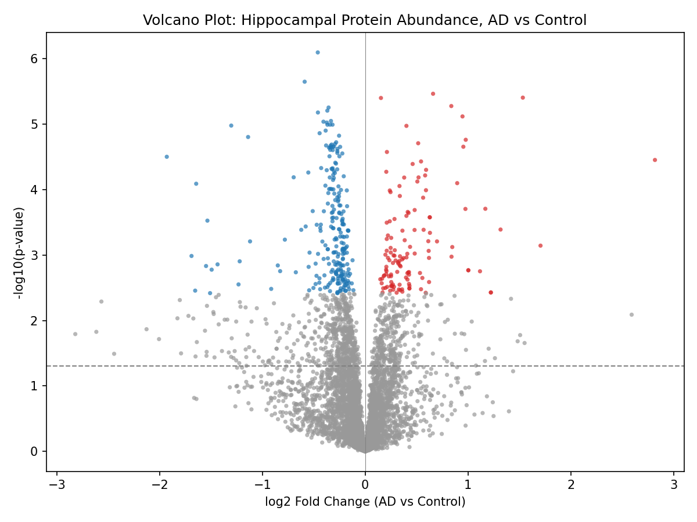
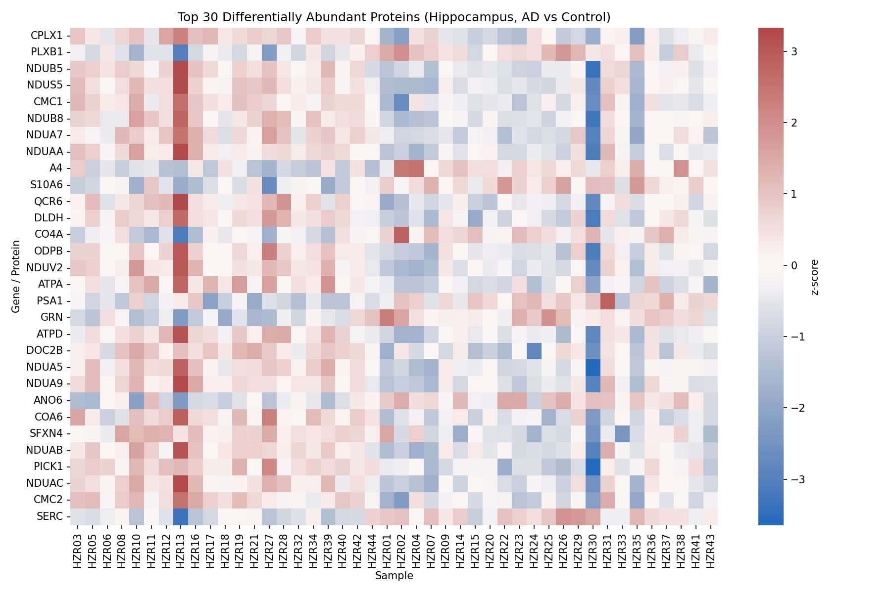
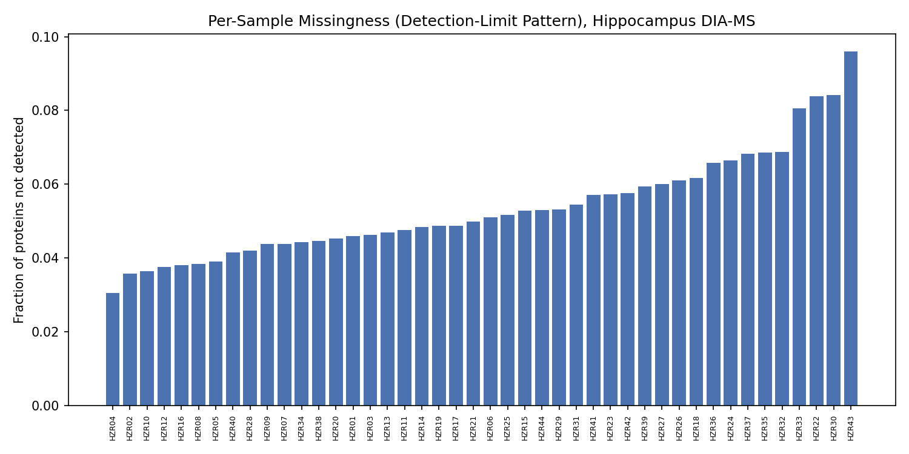
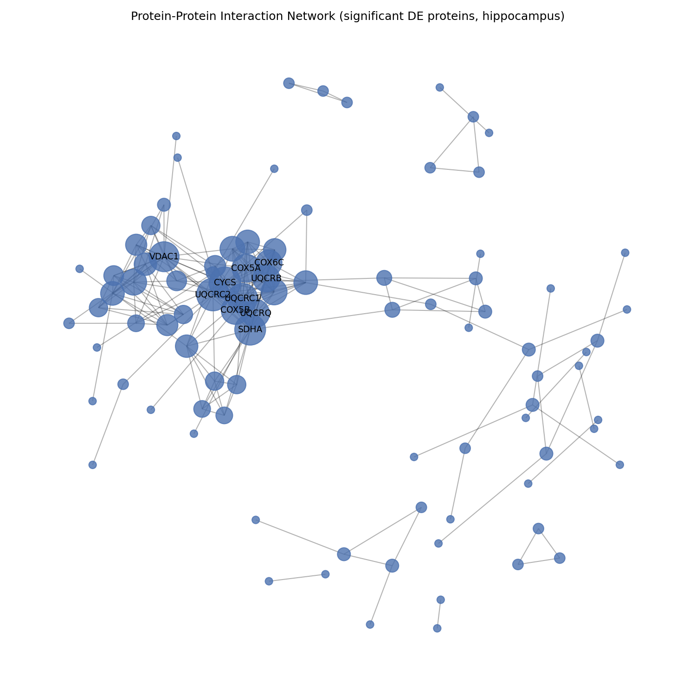

# Hippocampal Proteomics: Differential Abundance & Pathway Enrichment in Alzheimer's Disease

## Purpose

This repository contains an independent bioinformatics portfolio project for identifying differentially abundant proteins and enriched biological pathways in Alzheimer's disease (AD) using real, publicly available human hippocampal proteomics data.

The project implements an end-to-end Python workflow covering data acquisition, proteomics-specific preprocessing, differential abundance analysis, multiple-testing correction, visualization, functional enrichment, and protein-association network analysis.

This is an independent portfolio project and is not connected to my published research.

My co-authored *Scientific African* paper analyzed hippocampal **transcriptomics** (mRNA) in Alzheimer's disease. This project applies a related analytical framework to **proteomics** (protein-level) data instead, representing a different molecular data modality with its own preprocessing challenges, particularly detection-limit-driven missing values.

## Background

Alzheimer's disease is associated with widespread molecular changes in affected brain regions. Because mRNA abundance does not always correspond directly to protein abundance, proteomics provides complementary information about molecular changes at the protein level.

This project focuses on the hippocampus, a brain region strongly associated with Alzheimer's disease pathology, and analyzes protein-group abundance data to identify disease-associated molecular patterns and functional pathways.

## Data

The analysis uses the publicly available dataset from:

**Merrihew et al. (2023).** *A peptide-centric quantitative proteomics dataset for the phenotypic assessment of Alzheimer's disease.* Scientific Data.

* **ProteomeXchange:** PXD034525
* **DOI:** 10.6069/wefm-vv52
* **Data type:** DIA mass spectrometry
* **Tissue:** Human hippocampus
* **Unit of analysis:** Protein groups
* **Abundance scale:** Log2
* **Original data:** Normalized and batch-adjusted by the original study
* **Biological samples analyzed:** 44

  * AD: 23
  * Control: 21
* **QC/reference samples excluded:** 8

The original dataset contains four clinical categories (Sporadic AD, Autosomal-Dominant AD, Control-High-Path, and Control-Low-Path). For this portfolio analysis, these categories were collapsed into a two-group comparison of AD versus Control.

The dataset and publication are publicly documented in the original study.

## Pipeline

### 1. Data Acquisition

`01_download_data.py`

Downloads the published hippocampal protein abundance table and sample metadata from their public sources.

### 2. Proteomics Preprocessing

`02_preprocess.py`

The preprocessing workflow:

* excludes pooled QC/reference samples;
* converts the clinical groups into AD versus Control;
* treats zero abundance values as missing measurements rather than true biological zeros;
* filters proteins according to missingness;
* retains proteins detected in at least 70% of samples in at least one group;
* imputes remaining missing values using a simple left-censored, per-protein approach.

**Result:**

* 5,117 protein groups initially available
* 4,811 protein groups retained after filtering
* 44 biological samples analyzed

### 3. Differential Abundance Analysis

`03_differential_expression.py`

Differential abundance between AD and Control samples was evaluated using Welch's t-test for each protein.

Because the input abundance values are already on a log2 scale, the difference between group means is reported directly as log2 fold-change.

### 4. Multiple-Testing Correction

Benjamini-Hochberg false discovery rate (FDR) correction was applied to the per-protein p-values.

Using an FDR threshold of **q < 0.05**:

**369 of 4,811 proteins were identified as significantly differentially abundant.**

### 5. Visualization

`04_visualize.py`

The pipeline generates:

* volcano plot;
* heatmap of the top differentially abundant proteins;
* per-sample missing-value detection pattern.

The missingness visualization is particularly relevant to proteomics because detection-limit-driven missing values are an important characteristic of mass-spectrometry datasets.

### 6. Functional Enrichment

`05_enrichment_analysis.py`

The 369 significant proteins were analyzed using Enrichr through `gseapy`, using:

* KEGG 2021 Human
* GO Biological Process 2021

The enrichment analysis identified **Citrate cycle (TCA cycle)** as the top significantly enriched pathway after multiple-testing correction:

* **Overlap:** 5/30
* **Adjusted P-value:** 0.0268
* **Proteins:** IDH3G, IDH3B, OGDHL, SDHA, IDH3A

Other enriched terms were also examined, but did not meet the FDR < 0.05 threshold in the reported results.

### 7. Protein-Association Network Analysis

`06_ppi_network.py`

The 369 significant proteins were submitted to the STRING database to investigate their known and predicted protein associations.

The analysis identified:

* **215 high-confidence protein associations**
* network-level connectivity patterns
* hub proteins ranked according to degree

The top hub proteins were:

| Rank | Protein | Degree |
| ---: | ------- | -----: |
|    1 | UQCRC2  |     19 |
|    2 | CYCS    |     18 |
|    3 | SDHA    |     17 |
|    4 | UQCRC1  |     16 |
|    5 | VDAC1   |     16 |
|    6 | UQCRQ   |     14 |
|    7 | COX5A   |     14 |
|    8 | COX5B   |     14 |
|    9 | UQCRB   |     13 |
|   10 | COX6C   |     12 |

STRING networks represent protein associations that can include both physical and functional relationships; therefore, network edges should not automatically be interpreted as direct physical binding interactions. STRING scores represent confidence in an association rather than interaction strength or binding affinity.

## Key Results

| Analysis                            |                    Result |
| ----------------------------------- | ------------------------: |
| Biological samples                  |                        44 |
| AD samples                          |                        23 |
| Control samples                     |                        21 |
| Initial protein groups              |                     5,117 |
| Protein groups retained             |                     4,811 |
| Significant proteins (FDR < 0.05)   |                       369 |
| High-confidence STRING associations |                       215 |
| Top enriched pathway                | Citrate cycle (TCA cycle) |
| TCA adjusted P-value                |                    0.0268 |
| Top PPI hub                         |                    UQCRC2 |
| UQCRC2 degree                       |                        19 |

## Example Outputs

### Differential Abundance



### Top Differentially Abundant Proteins



### Missing-Value Pattern



### Protein-Association Network



The corresponding numerical results are available in:

* `results/enrichment_results.csv`
* `results/string_ppi_edges.csv`
* `results/hub_proteins.csv`

## Technical Stack

* Python
* pandas
* NumPy
* SciPy
* statsmodels
* matplotlib
* seaborn
* gseapy
* networkx
* STRING API

## Usage

Install the required packages:

```bash
pip install -r requirements.txt
```

Run the pipeline sequentially:

```bash
python 01_download_data.py
python 02_preprocess.py
python 03_differential_expression.py
python 04_visualize.py
python 05_enrichment_analysis.py
python 06_ppi_network.py
```

The scripts generate intermediate data files under `data/` and analysis outputs under `results/`.

## File Structure

```text
proteomics-de-pipeline/
├── 01_download_data.py
├── 02_preprocess.py
├── 03_differential_expression.py
├── 04_visualize.py
├── 05_enrichment_analysis.py
├── 06_ppi_network.py
├── requirements.txt
├── data/
└── results/
    ├── volcano_plot.png
    ├── heatmap_top_proteins.png
    ├── missingness_pattern.png
    ├── enrichment_results.csv
    ├── string_ppi_edges.csv
    ├── hub_proteins.csv
    └── ppi_network.png
```

## Limitations

This project is intended as a reproducible portfolio-level bioinformatics workflow rather than a fully optimized clinical or statistical proteomics analysis.

* The Welch's t-test plus per-protein imputation approach is simpler than specialized proteomics workflows such as limma with moderated variance estimation, MSstats, or DEP-based approaches.
* The four original clinical categories were collapsed into a two-group AD versus Control comparison.
* The analysis does not explicitly model covariates such as age, sex, disease subtype, or pathological burden.
* Only a single differential abundance framework was evaluated.
* The PPI analysis is based on STRING protein associations and should be interpreted as a biological-network analysis rather than proof of direct protein-protein binding.
* Additional validation using independent cohorts and proteomics-specific statistical frameworks would strengthen the biological conclusions.

## Interpretation

The analysis identified 369 significantly differentially abundant proteins between AD and Control hippocampal samples.

The significant enrichment of the **citrate cycle (TCA cycle)** suggests that mitochondrial and central metabolic processes may be represented among the proteins altered in the analyzed AD samples. The PPI network further highlighted several highly connected mitochondrial proteins, including UQCRC2, CYCS, SDHA, UQCRC1, and components of the cytochrome c oxidase and ubiquinol-cytochrome c reductase complexes.

These findings are hypothesis-generating and provide a computational starting point for further investigation rather than establishing a causal mechanism of Alzheimer's disease.

## Reproducibility

All major analysis steps are implemented as sequential Python scripts, and the generated figures and tabular results are included in the repository.

The workflow is designed so that the analysis can be regenerated from the publicly available source data using the provided scripts.
